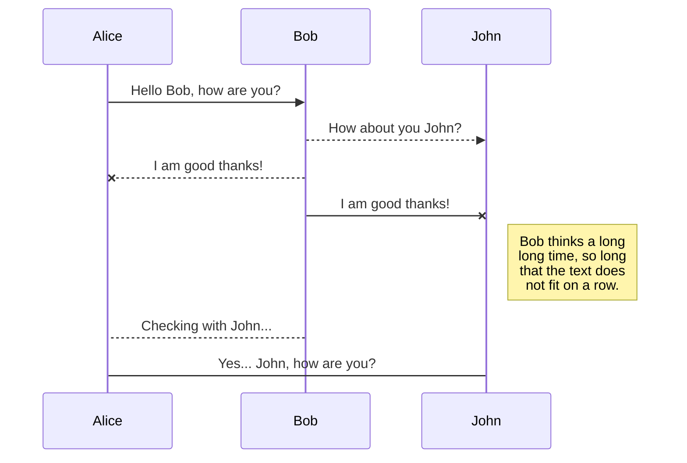
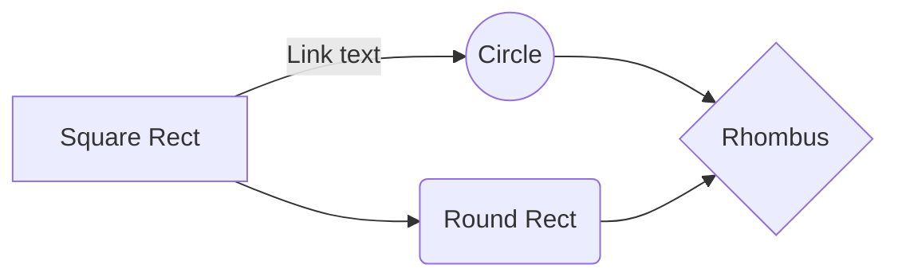

# FinGuide - Your Financial Advisor
 **financial advisory app** designed to help users manage their finances effectively. It offers finances advice, budgeting tools, and investment insights to ensure users make correct financial decisions.

## Key Features
- **Personal financial plan:** made plans based on user goals and financial status 📝
- **Budget Management:** track income and expenses Automatically 💰
- **Investment Recommendations:** tips for stocks, bonds, and mutual funds 📈
-  **Expense Analysis:**  detailed visual reports on user spending habits 📊
- **Goal Tracking:** set and track financial goals 🎯

## Installation Guide

1.  **Windows**  
 - Download the installer from the official website
 - Run the installer and follow the on-screen instructions 

 2.  **macOS**  
 - Download the app from the App Store. 
 - Open the app and follow the setup guide. 
 3.  **Linux** 
  - Download the package from the website.
  - Install using the terminal:  ```sudo dpkg -i FinGuide.deb ```

## User Guide 

### Creating a Project
To create a new financial project in FinGuide:
 - [ ] Open the app
 - [ ] Navigate to "New Project"
 - [ ] Name your project and set financial goals
 - [ ] Assign tasks and deadlines 
 - [ ] Save your project
 
 ### Collaboration 
| Feature          | Description                       |
|------------------|-----------------------------------|
| Shared Projects  | Collaborate on financial projects |
| Task Assignments | Assign financial tasks to different users|
| Communication Tools| Use chat for financial discussions|

### Generating Reports

Generate comprehensive financial reports to analyze your spending and savings:
```
public class FinancialReport {

    public static void main(String[] args) {
        Report report = new Report("2024-01-01 to 2024-04-31","SAR",new Income(10000, 8000, 2000),new Expenses(6000),2000,2000);
        System.out.println("Total Income: " + report.income.total);
        System.out.println("Total Expenses: " + report.expenses.total);
        System.out.println("Net Balance: " + report.netBalance);
    }
}
class Report {
    String period, currency;
    Income income;
    Expenses expenses;
    int savings, netBalance;
    public Report(String period, String currency, Income income, Expenses expenses, int savings, int netBalance) {
        this.period = period;
        this.currency = currency;
        this.income = income;
        this.expenses = expenses;
        this.savings = savings;
        this.netBalance = netBalance;
    }
}
class Income {
    int total, salary, investments;
    public Income(int total, int salary, int investments) {
        this.total = total;
        this.salary = salary;
        this.investments = investments;
    }
}
class Expenses {
    int totalExpenses
    public Expenses(int totalExpenses) {
        this.totalExpenses = totalExpenses;  
    }
}
```

## Troubleshooting

- **Installation Issues:** if the app doesn't install, ensure your OS meets the system requirements
- **Login Problems**: check your internet connection or reset your password
- **Inaccurate Budget Calculations:** if discrepancies occur, check your income and expense entries for accuracy and correct currency

## Advanced Usage

### Scripting
calculates total monthly expenses and checks if they exceed a specified limit


## Export a file

You can export the current file by clicking **Export to disk** in the menu. You can choose to export the file as plain Markdown, as HTML using a Handlebars template or as a PDF.


# Synchronization

Synchronization is one of the biggest features of StackEdit. It enables you to synchronize any file in your workspace with other files stored in your **Google Drive**, your **Dropbox** and your **GitHub** accounts. This allows you to keep writing on other devices, collaborate with people you share the file with, integrate easily into your workflow... The synchronization mechanism takes place every minute in the background, downloading, merging, and uploading file modifications.

There are two types of synchronization and they can complement each other:

- The workspace synchronization will sync all your files, folders and settings automatically. This will allow you to fetch your workspace on any other device.
	> To start syncing your workspace, just sign in with Google in the menu.

- The file synchronization will keep one file of the workspace synced with one or multiple files in **Google Drive**, **Dropbox** or **GitHub**.
	> Before starting to sync files, you must link an account in the **Synchronize** sub-menu.

## Open a file

You can open a file from **Google Drive**, **Dropbox** or **GitHub** by opening the **Synchronize** sub-menu and clicking **Open from**. Once opened in the workspace, any modification in the file will be automatically synced.

## Save a file

You can save any file of the workspace to **Google Drive**, **Dropbox** or **GitHub** by opening the **Synchronize** sub-menu and clicking **Save on**. Even if a file in the workspace is already synced, you can save it to another location. StackEdit can sync one file with multiple locations and accounts.

## Synchronize a file

Once your file is linked to a synchronized location, StackEdit will periodically synchronize it by downloading/uploading any modification. A merge will be performed if necessary and conflicts will be resolved.

If you just have modified your file and you want to force syncing, click the **Synchronize now** button in the navigation bar.

> **Note:** The **Synchronize now** button is disabled if you have no file to synchronize.

## Manage file synchronization

Since one file can be synced with multiple locations, you can list and manage synchronized locations by clicking **File synchronization** in the **Synchronize** sub-menu. This allows you to list and remove synchronized locations that are linked to your file.


# Publication

Publishing in StackEdit makes it simple for you to publish online your files. Once you're happy with a file, you can publish it to different hosting platforms like **Blogger**, **Dropbox**, **Gist**, **GitHub**, **Google Drive**, **WordPress** and **Zendesk**. With [Handlebars templates](http://handlebarsjs.com/), you have full control over what you export.

> Before starting to publish, you must link an account in the **Publish** sub-menu.

## Publish a File

You can publish your file by opening the **Publish** sub-menu and by clicking **Publish to**. For some locations, you can choose between the following formats:

- Markdown: publish the Markdown text on a website that can interpret it (**GitHub** for instance),
- HTML: publish the file converted to HTML via a Handlebars template (on a blog for example).

## Update a publication

After publishing, StackEdit keeps your file linked to that publication which makes it easy for you to re-publish it. Once you have modified your file and you want to update your publication, click on the **Publish now** button in the navigation bar.

> **Note:** The **Publish now** button is disabled if your file has not been published yet.

## Manage file publication

Since one file can be published to multiple locations, you can list and manage publish locations by clicking **File publication** in the **Publish** sub-menu. This allows you to list and remove publication locations that are linked to your file.


# Markdown extensions

StackEdit extends the standard Markdown syntax by adding extra **Markdown extensions**, providing you with some nice features.

> **ProTip:** You can disable any **Markdown extension** in the **File properties** dialog.


## SmartyPants

SmartyPants converts ASCII punctuation characters into "smart" typographic punctuation HTML entities. For example:

|                |ASCII                          |HTML                         |
|----------------|-------------------------------|-----------------------------|
|Single backticks|`'Isn't this fun?'`            |'Isn't this fun?'            |
|Quotes          |`"Isn't this fun?"`            |"Isn't this fun?"            |
|Dashes          |`-- is en-dash, --- is em-dash`|-- is en-dash, --- is em-dash|


## KaTeX

You can render LaTeX mathematical expressions using [KaTeX](https://khan.github.io/KaTeX/):

The *Gamma function* satisfying $\Gamma(n) = (n-1)!\quad\forall n\in\mathbb N$ is via the Euler integral

$$
\Gamma(z) = \int_0^\infty t^{z-1}e^{-t}dt\,.
$$

> You can find more information about **LaTeX** mathematical expressions [here](http://meta.math.stackexchange.com/questions/5020/mathjax-basic-tutorial-and-quick-reference).


## UML diagrams

You can render UML diagrams using [Mermaid](https://mermaidjs.github.io/). For example, this will produce a sequence diagram:



And this will produce a flow chart:


<!--stackedit_data:
eyJoaXN0b3J5IjpbNjU0MTQxOTEyLDIwOTQ0ODQyNzUsLTEwMz
k0Njk3NjAsMjA0MTc0NDUyNSwyMDkyNjI2ODI3LDEzMDcxNjE0
MzMsMjM4NjE0OTc5LC0yMjM4MzE4MDUsMTA5NTAxNDgxOCwtMz
IwNDY5OTY2LDEwMjYwMTI2NzYsMTE3ODM1OTkxMCwtNTQ2NzU1
NzQ2LDM2MjUxMzk5MiwtMTQ3Nzc0MTg2LDEwNjUyNTg0NzcsLT
ExMTk2MzI2ODksMTE0ODA1Njg4OCwxMDg2OTE4MTAsMTQwODk4
NDc4M119
-->